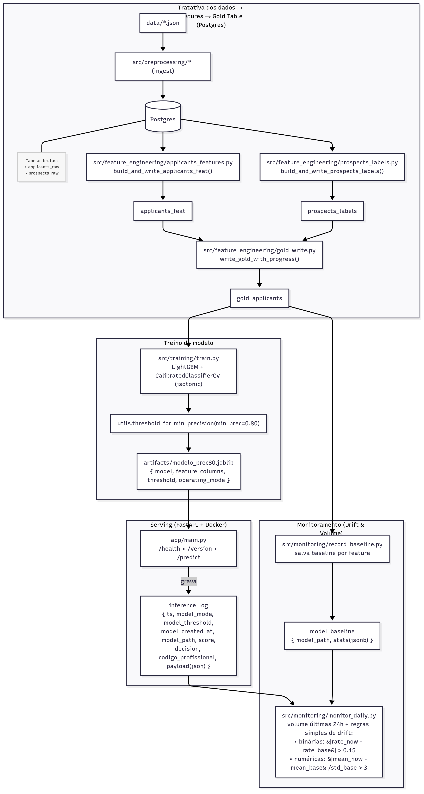

# 🧠 Projeto: Datathon MLET4 — Modelo de contratação (end-to-end)

## 🎯 Objetivo
Pipeline completo de Machine Learning para predição de contratação de candidatos, cobrindo:

- ✅ Ingestão & pré-processamento de **applicants** e **prospects** em PostgreSQL  
- ✅ Feature engineering (candidatos) + labels (prospects)  
- ✅ Tabela Gold (join de features + target)  
- ✅ Treino, avaliação e serialização do modelo (`joblib`) com threshold calibrado por precisão mínima  
- ✅ API FastAPI com endpoints `/predict`, `/health`, `/version`  
- ✅ Logs de inferência no banco para auditoria  
- ✅ Containerização (Docker/Compose) e execução local  
- ✅ Testes (`pytest`) com cobertura  
- ✅ Monitoramento simples de drift (baseline + rotina diária)  

---

## Diagrama do projeto



## 🧱 Stack
- Python 3.11  
- FastAPI  
- scikit-learn, LightGBM  
- PostgreSQL 15 (via Docker)  
- SQLAlchemy (IO com DB)  
- pytest (+ opcionalmente pytest-cov)  
- Docker / docker compose  

---

## 📦 Estrutura do repositório
```
.
├─ app/
│  └─ main.py                     # API FastAPI (/predict, /health, /version)
├─ src/
│  ├─ preprocessing/
│  │  ├─ applicants_ingest.py     # ingestão de applicants_raw
│  │  └─ prospects_ingest.py      # ingestão de prospects_raw
│  ├─ feature_engineering/
│  │  ├─ applicants_features.py   # features de applicants
│  │  ├─ prospects_labels.py      # labels de prospects
│  │  └─ gold.py                  # montagem da gold_applicants
│  ├─ training/
│  │  ├─ train.py                 # treino + calibração + artefato
│  │  └─ evaluate.py              # avaliação holdout
│  ├─ monitoring/
│  │  ├─ record_baseline.py       # baseline de features
│  │  └─ monitor_daily.py         # rotina diária de drift
│  └─ utils.py                    # helpers (DB, thresholds)
├─ artifacts/                     # artefatos (ex: modelo_prec80.joblib)
├─ tests/                         # testes da API, features e utils
├─ data/                          # arquivos JSON de entrada (opcional)
├─ Dockerfile
├─ docker-compose.yml
├─ .env
├─ requirements.txt
├─ requirements-api.txt
├─ pytest.ini, .coveragerc
└─ README.md
```

---

## 🔧 Configuração (local)

1. Criar ambiente virtual e instalar dependências:
```bash
python -m venv .venv
. .venv/Scripts/activate   # Windows PowerShell: .\.venv\Scripts\Activate.ps1
pip install -r requirements.txt
```

2. Criar arquivo `.env` (exemplo):
```ini
POSTGRES_USER=postgres
POSTGRES_PASSWORD=postgres
POSTGRES_HOST=localhost
POSTGRES_PORT=5432
POSTGRES_DB=postgres
POSTGRES_SCHEMA=public

# Artefato do modelo (usado pela API):
MODEL_ARTIFACT=./artifacts/modelo_prec80.joblib
```

3. Subir o Postgres com Docker:
```bash
docker compose up -d db
```

---

## 📥 Ingestão de dados

```bash
# Applicants -> applicants_raw
python -m src.preprocessing.applicants_ingest --json ./data/applicants.json --table applicants_raw

# Prospects -> prospects_raw
python -m src.preprocessing.prospects_ingest --json ./data/prospects.json --table prospects_raw
```

---

## 🧪 Feature Engineering & Labels

```bash
# Applicants -> applicants_feat
python -c "from src.feature_engineering.applicants_features import build_and_write_applicants_feat_chunked; print(build_and_write_applicants_feat_chunked('applicants_raw','applicants_feat'))"

# Prospects -> prospects_labels
python -c "from src.feature_engineering.prospects_labels import build_and_write_prospects_labels_chunked; print(build_and_write_prospects_labels_chunked('prospects_raw','prospects_labels'))"
```

---

## 🥇 Tabela Gold

```bash
python -c "from src.feature_engineering.gold import build_and_write_gold; print(build_and_write_gold('applicants_feat','prospects_labels','gold_applicants'))"
```

---

## 🤖 Treinamento, Avaliação e Artefato

```bash
# Treino (gera modelo_prec80.joblib)
python -m src.training.train

# Avaliação holdout
python -m src.training.evaluate
```

---

## 🌐 API (FastAPI)

Rodar API localmente:
```bash
uvicorn app.main:app --reload --host 0.0.0.0 --port 8000
```

Exemplo de payload para `/predict`:
```json
{
  "codigo_profissional": 31001,
  "features": {
    "tem_email": 1, "tem_telefone": 1, "tem_linkedin": 0, "tem_local": 1, "tem_objetivo": 1,
    "email_corporativo": 0, "salario_valor": 3000,
    "ingl_nenhum": 1, "ingl_basico": 0, "ingl_intermediario": 0, "ingl_avancado": 0, "ingl_outro": 0,
    "esp_nenhum": 1, "esp_basico": 0, "esp_intermediario": 0, "esp_avancado": 0, "esp_outro": 0,
    "outro_idioma_presente": 0,
    "esc_pos": 0, "esc_tecnologo": 0, "esc_medio": 0, "esc_superior_completo": 1, "esc_superior_incompleto": 0,
    "area_admin": 1, "area_ti": 0, "area_financeiro": 0,
    "titulo_admin": 1, "titulo_ti": 0, "titulo_dados_bi": 0, "titulo_financeiro": 0,
    "cert_mos_word": 0, "cert_mos_excel": 1, "cert_mos_outlook": 0, "cert_mos_powerpoint": 0, "cert_sap_fi": 0,
    "has_cert": 1,
    "cv_excel_avancado": 1, "cv_kpi": 0, "cv_controladoria": 0, "cv_contabil": 1, "cv_financeiro": 1, "cv_administrativo": 1,
    "cv_sap": 0, "cv_protheus": 0, "cv_navision": 0, "cv_tamanho_maior_1500": 0
  }
}
```

---

## 🐳 Docker / Compose

Subir todos os serviços:
```bash
docker compose up -d --build
```

Testar API dentro do container:
```bash
curl -s http://localhost:8000/health
curl -s http://localhost:8000/version | jq
```

Executar monitoramento no container:
```bash
# baseline (uma vez)
docker compose run --rm api python -m src.monitoring.record_baseline

# rotina diária
docker compose run --rm api python -m src.monitoring.monitor_daily
```

---

## 📊 Monitoramento (drift e volume)

1. Gravar baseline:
```bash
python -m src.monitoring.record_baseline
```

2. Checagem diária:
```bash
python -m src.monitoring.monitor_daily
```

---

## ✅ Testes & Cobertura

Rodar testes:
```bash
pytest
```

Com cobertura (se instalado `pytest-cov`):
```bash
pytest -q --cov=src --cov=app --cov-report=term-missing
```

---

## 🚀 Fluxo resumido (end-to-end)

1. Subir DB: `docker compose up -d db`  
2. Ingestão: `applicants_ingest` e `prospects_ingest`  
3. Features/Labels: `build_and_write_applicants_feat_chunked` e `build_and_write_prospects_labels_chunked`  
4. Gold: `build_and_write_gold`  
5. Treino: `python -m src.training.train`  
6. Avaliação: `python -m src.training.evaluate` (opcional)  
7. API: `uvicorn app.main:app --reload` ou `docker compose up -d --build`  
8. Monitoramento: `record_baseline.py` e `monitor_daily.py`  
